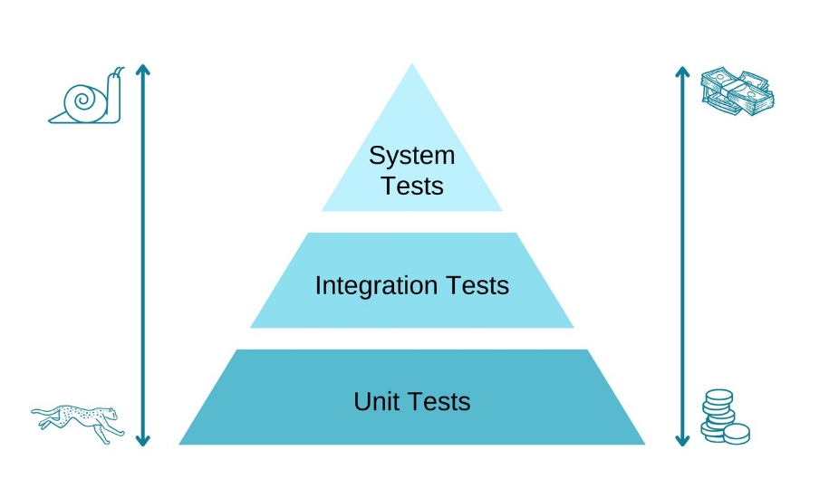

# Automatisiertes Testen + TDD

## AUFGABE 1: THEORIE

## Testdriven Development (TDD)
Test Driven Development (TDD) ist eine agile Entwicklungspraktik, bei der Entwickler zuerst Tests schreiben, bevor sie den eigentlichen Code implementieren. Das Ziel von TDD ist es, die Qualität des Codes zu verbessern und mögliche Fehler frühzeitig im Entwicklungsprozess zu erkennen.

Die TDD-Praktik beinhaltet in der Regel folgende Schritte:
1. Schreiben eines Tests: Der Entwickler schreibt einen Test, der die Funktionalität überprüft, die er implementieren möchte. Der Test sollte fehlschlagen, da die Funktionalität noch nicht vorhanden ist.
2. Implementierung: Der Entwickler schreibt den Code, um den Test zu bestehen.
3. Testausführung: Der Test wird ausgeführt, um sicherzustellen, dass er erfolgreich ist.
4. Refaktorisierung: Der Entwickler verbessert den Code, um sicherzustellen, dass er lesbarer, verständlicher und effizienter ist.

Indem Tests zuerst geschrieben werden, kann sichergestellt werden, dass der Code korrekt funktioniert und dass mögliche Fehler frühzeitig erkannt werden. Dies führt zu einem besseren Design und einer besseren Qualität des Codes und reduziert das Risiko von Regressionen.

## Red-Green-Refactor
"Red-Green-Refactor" ist ein Prozess, der typischerweise bei der Anwendung von Test Driven Development (TDD) verwendet wird. Der Prozess besteht aus drei Schritten:

1. Red: In diesem Schritt schreibt der Entwickler einen Test, der die Funktionalität überprüft, die er implementieren möchte. Der Test sollte fehlschlagen, da die Funktionalität noch nicht vorhanden ist (d.h. der Test wird rot).
2. Green: In diesem Schritt schreibt der Entwickler den Code, um den Test zu bestehen. Der Test sollte jetzt erfolgreich sein (d.h. der Test wird grün).
3. Refactor: In diesem Schritt überprüft der Entwickler den Code und verbessert ihn gegebenenfalls, um sicherzustellen, dass er lesbarer, verständlicher und effizienter ist.

Indem man den Red-Green-Refactor-Prozess wiederholt, kann man sicherstellen, dass der Code korrekt funktioniert und dass mögliche Fehler frühzeitig erkannt werden. Dies führt zu einem besseren Design und einer besseren Qualität des Codes und reduziert das Risiko von Regressionen.

## FIRST-Acronym
Das FIRST-Akronym ist ein Merksatz für die wichtigsten Merkmale von guten Tests. Das Akronym steht für:

- Fast: Tests sollten schnell ausgeführt werden können, um schnelles Feedback zu ermöglichen und den Entwicklungsprozess zu beschleunigen.
- Isolated/Independent: Tests sollten unabhängig voneinander ausgeführt werden können, um sicherzustellen, dass ein einzelner Test nicht von einem anderen beeinflusst wird.
- Repeatable: Tests sollten jederzeit wiederholbar sein, um sicherzustellen, dass sie immer dieselben Ergebnisse liefern.
- Self-Validating: Tests sollten automatisiert und objektiv sein, um menschliche Fehler zu reduzieren und eine schnelle Fehlererkennung zu ermöglichen.
- Timely: Tests sollten zeitnah geschrieben werden, um sicherzustellen, dass sie die Funktionalität testen, bevor sie in die Produktion gehen.

Indem man diese Prinzipien befolgt, können effektive Tests geschrieben werden, die dazu beitragen, die Qualität des Codes zu verbessern und mögliche Fehler frühzeitig zu erkennen.

## Kent Beck (welche Rolle spielt er in Bezug auf TDD)
Kent Beck ist ein bekannter Softwareentwickler und Autor, der als Erfinder von Test Driven Development (TDD) gilt. Er ist einer der Pioniere der agilen Softwareentwicklung und hat zahlreiche Bücher und Artikel zu diesem Thema geschrieben.

Beck entwickelte TDD in den späten 1990er Jahren als Teil seiner Arbeit an dem Programmierframework "Extreme Programming" (XP). Die Idee von TDD basiert auf der Vorstellung, dass Tests nicht nur zur Überprüfung der Funktionalität des Codes verwendet werden sollten, sondern dass sie auch bei der Entwicklung helfen sollten, indem sie als Anleitung für die Implementierung der Funktionalität dienen.

Beck hat auch an anderen wichtigen Projekten gearbeitet, wie z.B. der Entwicklung des Programmierframeworks "JUnit", das zur Erstellung von Unit-Tests in Java eingesetzt wird. Er hat auch andere agile Methoden wie "Refactoring" und "Pair Programming" popularisiert.

## Testarten
Tests werden in der Softwareentwicklung verwendet, um sicherzustellen, dass der Code korrekt funktioniert und dass mögliche Fehler frühzeitig erkannt werden. Es gibt verschiedene Arten von Tests, die in der Regel in einer bestimmten Reihenfolge ausgeführt werden, um sicherzustellen, dass der Code effektiv getestet wird. Die wichtigsten Testarten sind:

1. Unit-Tests
2. Integrationstests
3. UI-Tests / End-to-End Tests / Systemtests
4. Akzeptanztests

### Unit Tests
Unit-Tests sind eine Art von Tests in der Softwareentwicklung, die darauf abzielen, einzelne Komponenten (Units) des Codes, wie z.B. Funktionen oder Methoden, zu testen, um sicherzustellen, dass sie korrekt funktionieren.

Ein Unit-Test besteht aus einer Reihe von Testszenarien, die entworfen wurden, um sicherzustellen, dass eine bestimmte Komponente den erwarteten Input verarbeiten und den erwarteten Output generieren kann. Dabei wird in der Regel ein Testframework wie JUnit verwendet, um die Tests durchzuführen.

Es gibt verschiedene Ansätze bei der Erstellung von Unit-Tests:

- Sociable Unit Tests: Bei dieser Methode werden mehrere Units zusammengetestet, um sicherzustellen, dass sie ordnungsgemäß zusammenarbeiten. Dabei kann es sich um eine Klasse oder ein Modul handeln, das mehrere Methoden enthält. Der Fokus liegt darauf, dass alle Komponenten zusammen funktionieren.

- Solitary Unit Tests: Hier wird eine Unit isoliert getestet, um sicherzustellen, dass sie unabhängig von anderen Komponenten korrekt funktioniert. Dazu werden externe Abhängigkeiten durch "Mocks" ersetzt, um eine unabhängige Testumgebung zu schaffen.

- Mock Tests: Hier wird eine externe Abhängigkeit durch eine "Mock"-Komponente ersetzt, um sicherzustellen, dass die getestete Komponente unabhängig und isoliert getestet werden kann. Eine Mock-Komponente ist eine spezielle Komponente, die die Funktionalität der tatsächlichen Komponente nachahmt, aber nur für Testzwecke verwendet wird.

Unit-Tests haben den Vorteil, dass sie schnell ausgeführt werden können, da sie nur eine Komponente des Codes testen. Sie helfen auch dabei, die Qualität des Codes zu verbessern, da mögliche Fehler in der Komponente frühzeitig erkannt werden können. Darüber hinaus können sie dazu beitragen, dass der Code einfacher zu warten und zu erweitern ist, da sie die Komponenten des Codes klar abgrenzen und isolieren.

### Integrationstests
Integrationstests sind eine Art von Tests in der Softwareentwicklung, die darauf abzielen, die Zusammenarbeit von mehreren Komponenten (Units) oder Systemen zu testen, um sicherzustellen, dass sie ordnungsgemäß miteinander kommunizieren und funktionieren.

Im Gegensatz zu Unit-Tests, die sich auf die Tests einzelner Komponenten konzentrieren, testen Integrationstests mehrere Komponenten und Systeme gleichzeitig, um sicherzustellen, dass sie ordnungsgemäß zusammenarbeiten. Integrationstests können helfen, Probleme aufzudecken, die sich aus der Integration von verschiedenen Komponenten ergeben können, wie z.B. unvorhergesehene Auswirkungen von Änderungen an einer Komponente auf andere Komponenten oder Abhängigkeiten.

Integrationstests können auf verschiedenen Ebenen durchgeführt werden:

- Komponentenintegrationstests: Diese Tests konzentrieren sich auf die Integration von einzelnen Komponenten oder Units, um sicherzustellen, dass sie ordnungsgemäß miteinander kommunizieren und funktionieren.

- Integrationstests auf Systemebene: Diese Tests konzentrieren sich auf die Integration von mehreren Komponenten und Systemen, um sicherzustellen, dass sie ordnungsgemäß zusammenarbeiten und die erwarteten Ergebnisse liefern.

Integrationstests können automatisiert oder manuell durchgeführt werden. Automatisierte Integrationstests können in einem Continuous-Integration-System integriert werden, um sicherzustellen, dass die Integration von Komponenten und Systemen bei jeder Änderung an der Codebasis automatisch getestet wird.

### UI-Tests / End-To-End Tests / Systemtests
UI-Tests, End-to-End-Tests und Systemtests sind alle Arten von Tests in der Softwareentwicklung, die darauf abzielen, das Verhalten der Software in der realen Welt zu testen.

- UI-Tests oder Benutzeroberflächentests konzentrieren sich auf die Überprüfung, ob die Benutzeroberfläche der Software ordnungsgemäß funktioniert. Sie testen, ob die Benutzeroberfläche die erwarteten Ergebnisse liefert und ob sie auf verschiedenen Plattformen und Geräten korrekt angezeigt wird. UI-Tests können manuell oder automatisiert durchgeführt werden, indem Tools wie Selenium oder Cypress verwendet werden.

- End-to-End-Tests sind Tests, die das Verhalten der gesamten Software von Anfang bis Ende simulieren. Sie testen die Funktionen der Software, indem sie die Nutzerinteraktionen simulieren und sicherstellen, dass die Software in der Praxis korrekt funktioniert. End-to-End-Tests können manuell oder automatisiert durchgeführt werden und können auch die Integration mit anderen Systemen oder Diensten testen.

- Systemtests sind Tests, die das gesamte System testen, einschließlich aller Komponenten und Subsysteme. Sie testen, ob das System den Anforderungen und Spezifikationen entspricht und die erwarteten Ergebnisse liefert. Systemtests können manuell oder automatisiert durchgeführt werden und können auch die Last- und Stresstests beinhalten.

### Akzeptanztests
Diese Tests werden normalerweise durchgeführt, um sicherzustellen, dass die Software den Benutzerbedürfnissen und -erwartungen entspricht und den vorgegebenen Anforderungen gerecht wird. Akzeptanztests werden oft von den Kunden oder Anwendern der Software durchgeführt, um sicherzustellen, dass das Produkt für ihre Bedürfnisse geeignet ist.

Die Akzeptanztests können manuell oder automatisiert durchgeführt werden und können verschiedene Formen annehmen. Ein Beispiel für eine Art von Akzeptanztest ist der Akzeptanztest auf Basis von Geschäftsanforderungen. Hierbei wird getestet, ob die Software den Geschäftsanforderungen entspricht und die Geschäftsprozesse korrekt unterstützt.

Ein weiteres Beispiel für eine Art von Akzeptanztest ist der User-Acceptance-Test (UAT). Hierbei testen die Benutzer oder Endanwender die Software auf Funktionalität, Benutzerfreundlichkeit und andere wichtige Faktoren, um sicherzustellen, dass sie für ihre Bedürfnisse geeignet ist.

Insgesamt dienen Akzeptanztests dazu, sicherzustellen, dass die Software den Anforderungen und Bedürfnissen der Benutzer und Kunden entspricht. Durch die Durchführung von Akzeptanztests können mögliche Fehler oder Probleme in der Software identifiziert und behoben werden, bevor sie in der realen Welt zu Problemen führen.

## Testpyramide
Die Testpyramide ist ein Konzept in der Softwareentwicklung, das die Bedeutung verschiedener Arten von Tests in einer Softwareanwendung hervorhebt und eine Struktur für deren Implementierung bietet. Die Idee ist, dass eine gut strukturierte Testpyramide eine breite Basis von schnellen und kosteneffektiven Tests hat, die automatisiert werden können, während die Tests an der Spitze spezifischer und langsamer sind.

Die Testpyramide besteht aus drei Schichten:

- Unit-Tests: Dies ist die unterste Schicht der Testpyramide und umfasst Tests, die einzelne Komponenten der Software isoliert prüfen. Die Unit-Tests sollten schnell und kosteneffektiv sein, da sie automatisiert werden können und schnell Feedback geben, ob eine bestimmte Komponente richtig funktioniert.

- Integrationstests: Die mittlere Schicht der Testpyramide umfasst Tests, die die Integration von Komponenten in der Software prüfen. Diese Tests sind langsamer und teurer als Unit-Tests, da sie oft eine Vielzahl von Komponenten gleichzeitig testen.

- End-to-End-Tests: Die oberste Schicht der Testpyramide umfasst Tests, die die gesamte Anwendung prüfen, als ob sie von einem Benutzer verwendet wird. Diese Tests sind langsam und teuer, da sie die gesamte Anwendung durchlaufen und oft manuelle Interaktion erfordern.

Die breite Basis der Pyramide besteht aus kosteneffektiven, automatisierten Tests, die schnell Feedback geben und sicherstellen, dass die einzelnen Komponenten der Software korrekt funktionieren. Je höher man in der Pyramide geht, desto spezifischer und langsamer werden die Tests, aber sie bieten eine höhere Abdeckung der Software und stellen sicher, dass alle Komponenten effektiv zusammenarbeiten.

## JUNIT (Junit5)
Junit ist eine Open-Source-Test- und Entwickler-Plattform für Java-Programme, die für das Schreiben und Ausführen von automatisierten Tests in Java-Anwendungen entwickelt wurde. Junit ist eine der am häufigsten verwendeten Testframeworks für Java.

Junit unterstützt verschiedene Arten von Tests wie Unit-Tests, Integrationstests und funktionale Tests und bietet eine breite Palette von Funktionen für das Schreiben von Tests, wie z.B. Assertions, Annotationen, Parameterisierung, Test-Runner, Test-Fixture, Test-Suite usw.

Junit5 ist die neueste Version von Junit und bietet viele neue Funktionen, darunter:

- Erweiterung Model: Erweiterungen erlauben Entwicklern, das Verhalten von Junit zu erweitern und anzupassen, ohne die Kernbibliothek zu ändern.
- Parameterisierung: Eine Möglichkeit, Tests mit verschiedenen Eingaben auszuführen, ohne den Testcode wiederholen zu müssen.
- Neue Annotations: Neue Annotationen wurden hinzugefügt, um den Test-Code zu vereinfachen und zu strukturieren, z.B. @BeforeEach, @AfterEach, @BeforeAll und @AfterAll.
U- nterstützung für Java 8 Lambdas: Entwickler können jetzt Lambda-Ausdrücke verwenden, um Tests zu definieren, was die Lesbarkeit und Wartbarkeit von Testcode verbessert.

## Mockito (Sinn und Funktionsweise von Mocking-Bibliotheken)
Mockito ist eine der bekanntesten und am häufigsten verwendeten Mocking-Bibliotheken für Java-Programmierung und wird häufig in Kombination mit JUnit verwendet. Mocking-Bibliotheken ermöglichen es Entwicklern, isolierte Tests durchzuführen, indem sie bestimmte Teile des Codes durch simulierten Code ersetzen, der das Verhalten des Originalcodes nachahmt.

Das Mocking-Konzept basiert auf der Erstellung von sogenannten Mock-Objekten, die das Verhalten des Originalobjekts simulieren. In der Regel werden Mock-Objekte verwendet, um die Abhängigkeiten von Testobjekten aufzulösen. Das bedeutet, dass, wenn ein Testobjekt eine Methode eines anderen Objekts aufruft, das Mock-Objekt anstelle des realen Objekts aufgerufen wird.

Mockito bietet eine einfache API, um Mock-Objekte zu erstellen und das Verhalten der Mock-Objekte zu konfigurieren, wie z.B. wie sie auf Methodenaufrufe reagieren oder wie sie sich bei Fehlern verhalten sollen. Mit Mockito können Entwickler auch Prüfungen durchführen, ob bestimmte Methoden auf Mock-Objekten aufgerufen wurden oder nicht.

# AUFGABE 2: AUSGANGSPROJEKT

